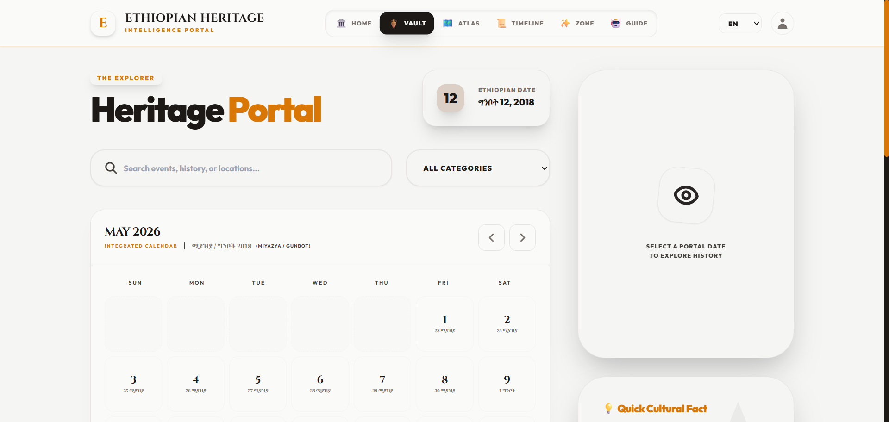
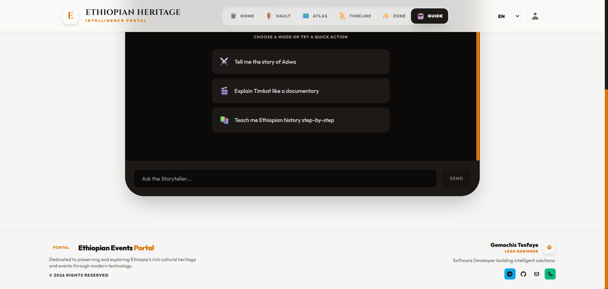
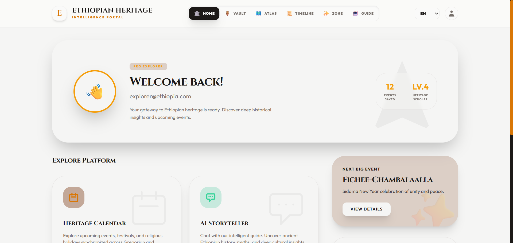

# 🌍 Ethiopian Heritage Portal: A Cultural Intelligence Platform


An advanced, interactive web portal designed to preserve and explore Ethiopian culture through a unique dual-calendar system, AI-powered insights, and private cultural planning. This project serves as a showcase of modern frontend engineering, complex state management, and seamless GenAI integration.

---

## 📸 Platform Interface Preview

<table>
  <tr>
    <td align="center" width="50%">
      
      <br/><b>📅 Dual Calendar View</b>
    </td>
    <td align="center" width="50%">
      
      <br/><b>🗺️ Interactive Heritage Map</b>
    </td>
  </tr>
  <tr>
    <td align="center" width="50%">
      
      <br/><b>🤖 AI Heritage Guide</b>
    </td>
    <td align="center" width="50%">
      
      <br/><b>🎉 Culture Zone & Trivia</b>
    </td>
  </tr>
  <tr>
    <td align="center" width="50%">
      
      <br/><b>📜 Historical Timeline Archive</b>
    </td>
    <td align="center" width="50%">
      
      <br/><b>🌄 Featured Festivals</b>
    </td>
  </tr>
</table>

---

## 🌟 Key Features

### 📅 Advanced Dual-Calendar System
The heart of the portal is a high-precision calendar engine that synchronizes the **Gregorian** and **Ethiopian (Ge'ez)** calendars. 
- **13-Month Support:** Full handling of the Ethiopian 13th month (*Pagumē*).
- **Precise Conversion:** Implements the Julian Day Number (JDN) algorithm for zero-offset accuracy between calendar systems.
- **Integrated Events:** View cultural, religious, and public holidays mapped across both timelines.

### 🤖 AI Heritage Guide & Insights
Leveraging the **Google Gemini API**, the portal provides deep cultural immersion:
- **Heritage Guide (Chat):** A real-time AI assistant trained to answer complex questions about Ethiopian history, traditions, and geography.
- **Cultural Insights:** Automated generation of fascinating facts for every major festival.
- **Amharic TTS:** High-fidelity text-to-speech for correct Amharic pronunciation of event names.

### 🏺 Private Heritage Box (Reminder System)
A secure, client-side reminder system for personal cultural planning:
- **Priority & Categorization:** Organize plans with 'Religious', 'Travel', or 'Social' tags and set 'Low' to 'High' priorities.
- **Local Persistence:** All data is stored privately in the user's browser via `localStorage`, ensuring privacy and speed.

### ✨ Culture Zone
- **AI Trivia:** Dynamically generated multiple-choice questions about Ethiopian heritage.
- **Interactive Exploration:** Thematic cards covering Food, Music, and History.

---

## 🛠️ Technical Stack

| Category | Technology | Version | Purpose |
|---|---|---|---|
| **UI Framework** | React | ^19.2.4 | Component-based UI rendering with JSX |
| **DOM Renderer** | React DOM | ^19.2.4 | React rendering into the browser DOM |
| **Build Tool** | Vite | ^6.2.0 | Lightning-fast dev server & production bundler |
| **Vite Plugin** | @vitejs/plugin-react | ^5.0.0 | JSX transformation & React Fast Refresh |
| **AI Engine** | @google/genai | ^1.41.0 | Gemini API — chat, trivia generation & Amharic TTS |
| **Authentication** | @supabase/supabase-js | ^2.106.0 | User auth, session management & database |
| **Mapping** | Leaflet | ^1.9.4 | Core interactive map rendering engine |
| **Map Components** | React-Leaflet | ^5.0.0 | React wrapper for Leaflet map integration |
| **Geo Data** | topojson-client | ^3.1.0 | Converts TopoJSON → GeoJSON for regional boundaries |
| **Animations** | Framer Motion | ^12.39.0 | Premium UI transitions and micro-animations |
| **Localization** | i18next | ^26.2.0 | Multi-language framework (EN / AM / OM) |
| **Lang Detection** | i18next-browser-languagedetector | ^8.2.1 | Auto-detects user's browser language |
| **React i18n** | react-i18next | ^17.0.8 | React hooks & components for i18next |
| **Styling** | Tailwind CSS | (via CDN) | Utility-first responsive styling — warm stone palette |
| **Date Logic** | Custom JDN Algorithm | — | Ethiopian ↔ Gregorian calendar conversion |
| **State Management** | React Hooks | built-in | `useState`, `useEffect`, `useMemo`, `useRef` |
| **Persistence** | localStorage | built-in | Private heritage vault & chat history |

---

## 📂 Project Structure

```text
ethiopian-heritage-portal/
├── src/
│   ├── components/      # Modular UI components (Calendar, Chat, Trivia) in JS/JSX
│   ├── services/        # Gemini API integration and AI logic
│   ├── utils/           # Calendar conversion and JDN utilities
│   ├── locales/         # Translation JSON files for en, am, and om
│   ├── App.jsx          # Main application component
│   ├── constants.js     # Heritage data and event definitions
│   ├── i18n.js          # Localization framework configuration
│   ├── index.css        # Global CSS / styling
│   └── index.jsx        # React root mount entry point
├── index.html           # Main HTML document
└── vite.config.js       # Vite build tool config
```

---

## ⚠️ System Limitations & Fallbacks

> [!CAUTION]
> **API Connectivity** — AI chat, trivia & TTS require an active internet connection. Falls back to a built-in offline registry with 100+ trivia questions & historical data.

> [!CAUTION]
> **Data Persistence** — Heritage vault reminders are stored in `localStorage` only. Does not sync across devices or private browsing sessions.

> [!CAUTION]
> **Map Boundaries** — Regional GeoJSON is fetched on page load and requires internet. Region summaries & cultural profiles remain interactive offline.

> [!CAUTION]
> **Supabase Auth** — Login, signup & password reset require an active internet connection. Session persists locally until expiry.

---

## 🚀 About the Developer

**Gemachis Tesfaye**  
*Software Engineer*

- **GitHub**: [@gemachistesfaye](https://github.com/gemachistesfaye)
- **Telegram**: [@urjiiko1](https://t.me/urjiiko1)
- **Email**: [gemachistesfaye36@gmail.com](mailto:gemachistesfaye36@gmail.com)

---

**All Rights Reserved © 2026**
