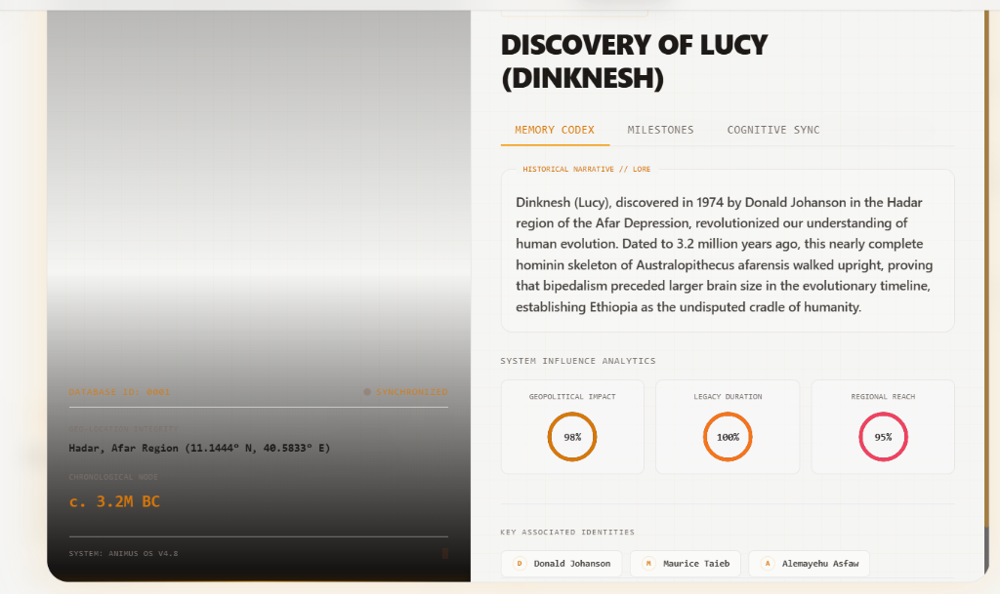
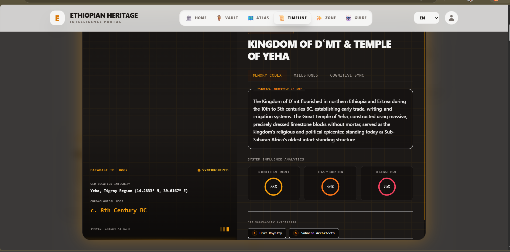

# 🌍 Ethiopian Heritage Portal: A Cultural Intelligence Platform


An advanced, interactive web portal designed to preserve and explore Ethiopian culture through a unique dual-calendar system, AI-powered insights, and private cultural planning. This project serves as a showcase of modern frontend engineering, complex state management, and seamless GenAI integration.

---

## 📸 Platform Interface Preview

| Feature | Screenshot |
| --- | --- |
| **Integrated Dual-Calendar System**<br>Interactive calendar view showing Gregorian dates paired with Ethiopian (Ge'ez) dates, custom JDN calculation engine, and integrated holiday markers. |  |
| **Interactive Cultural Atlas**<br>High-fidelity maps of Ethiopia with selectable regional profiles showing local food, music, clothing, and landmarks. |  |
| **AI Heritage Guide Chatbot**<br>Context-aware conversational guide backed by Gemini API with role selections (storyteller, teacher, guide, etc.). |  |
| **Culture Zone & AI Trivia**<br>Gamified trivia pool with multiple-choice questions on history and geography, plus thematic history cards. |  |
| **Secure Authentication**<br>Supabase-based user authorization flow including sign up, login, and password management cards. |  |
| **Unified Settings & Customizer**<br>Manage platform preferences, calendar systems, notification systems, and security settings. |  |

---

## 🌟 Key Features

### 📅 Advanced Dual-Calendar System
The heart of the portal is a high-precision calendar engine that synchronizes the **Gregorian** and **Ethiopian (Ge'ez)** calendars. 
- **13-Month Support:** Full handling of the Ethiopian 13th month (*Pagumē*).
- **Precise Conversion:** Implements the Julian Day Number (JDN) algorithm for zero-offset accuracy between calendar systems.
- **Integrated Events:** View cultural, religious, and public holidays mapped across both timelines.

### 🤖 AI Heritage Guide & Insights
Leveraging the **Google Gemini API**, the portal provides deep cultural immersion:
- **Heritage Guide (Chat):** A real-time AI assistant trained to answer complex questions about Ethiopian history, traditions, and geography.
- **Cultural Insights:** Automated generation of fascinating facts for every major festival.
- **Amharic TTS:** High-fidelity text-to-speech for correct Amharic pronunciation of event names.

### 🏺 Private Heritage Box (Reminder System)
A secure, client-side reminder system for personal cultural planning:
- **Priority & Categorization:** Organize plans with 'Religious', 'Travel', or 'Social' tags and set 'Low' to 'High' priorities.
- **Local Persistence:** All data is stored privately in the user's browser via `localStorage`, ensuring privacy and speed.

### ✨ Culture Zone
- **AI Trivia:** Dynamically generated multiple-choice questions about Ethiopian heritage.
- **Interactive Exploration:** Thematic cards covering Food, Music, and History.

---

## 🛠️ Technical Stack

- **Frontend:** React 19 (JavaScript / ES6 Modules / JSX)
- **Styling:** Tailwind CSS (Modern, mobile-first, warm 'stone' palette and refined typography)
- **Intelligence:** Google Gemini 3 Flash & Gemini 2.5 Flash (TTS)
- **Date Logic:** Custom JDN conversion algorithms
- **State Management:** Native React Hooks (`useMemo`, `useEffect`, `useState`)

---

## 📂 Project Structure

```text
ethiopian-heritage-portal/
├── src/
│   ├── components/      # Modular UI components (Calendar, Chat, Trivia) in JS/JSX
│   ├── services/        # Gemini API integration and AI logic
│   ├── utils/           # Calendar conversion and JDN utilities
│   ├── locales/         # Translation JSON files for en, am, and om
│   ├── App.jsx          # Main application component
│   ├── constants.js     # Heritage data and event definitions
│   ├── i18n.js          # Localization framework configuration
│   ├── index.css        # Global CSS / styling
│   └── index.jsx        # React root mount entry point
├── index.html           # Main HTML document
└── vite.config.js       # Vite build tool config
```

---

## ⚠️ System Limitations & Fallbacks

- **API Rate Limits & Connectivity**: The AI guide, translation helper, and text-to-speech components rely on cloud API endpoints. If rate limits are reached or a connection drops, the platform seamlessly activates a robust **local offline registry** covering key historical events, country statistics, language profiles, national symbols, and a shuffled pool of 100 offline trivia questions.
- **Local Data Persistence**: The "Private Heritage Box" stores user reminders entirely client-side using `localStorage`. Plans are private and fast but do not synchronize across different browsers, devices, or private browsing sessions.
- **Interactive Map Data Fetching**: Regional boundaries on the interactive map are rendered from GeoJSON fetched on page load. A continuous network connection is required to render the vector boundaries, though the region summaries and offline data remain interactive.
- **Supabase Authentication**: Modifying account credentials, logging in, or resetting passwords requires an active internet connection to securely communicate with the Supabase authorization servers.
---

## 🚀 About the Developer

**Gemachis Tesfaye**  
*Software Engineer & Data Specialist*

- **GitHub**: [@gemachistesfaye](https://github.com/gemachistesfaye)
- **Telegram**: [@urjiiko1](https://t.me/urjiiko1)
- **Email**: [gemachistesfaye36@gmail.com](mailto:gemachistesfaye36@gmail.com)

---

**All Rights Reserved © 2026**
