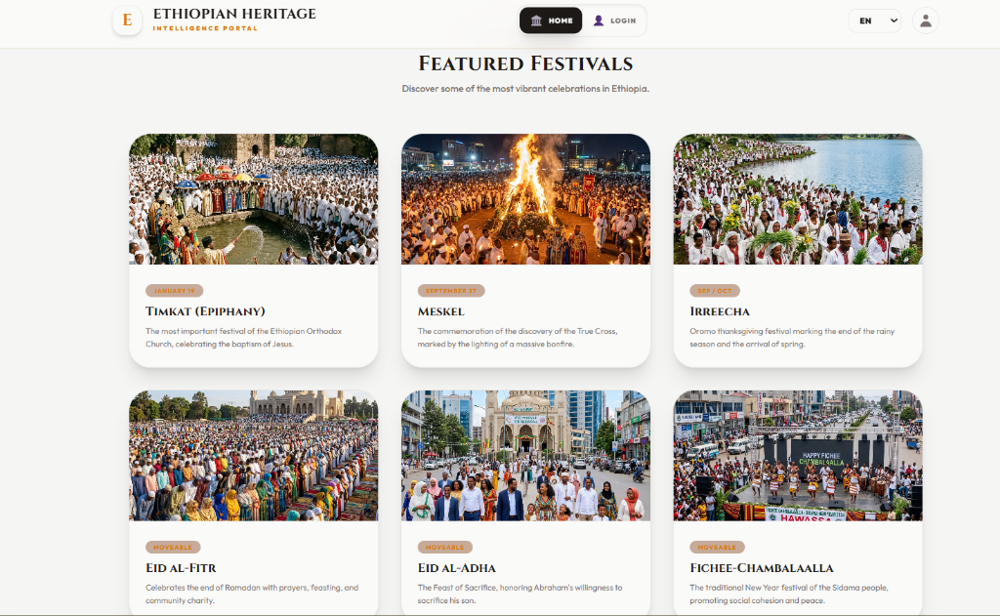

# Featured Festivals

## Overview
Discover some of the most vibrant and culturally significant celebrations across Ethiopia directly from the home page.

## Key Features
- **Curated Celebrations:** Highlights major events like Timkat, Meskel, Irreecha, and Eid al-Fitr.
- **Dynamic Previews:** Offers stunning visuals and brief descriptions of each festival's importance.
- **Unified Access:** Connects visitors directly to detailed historical and cultural contexts for each major holiday.
