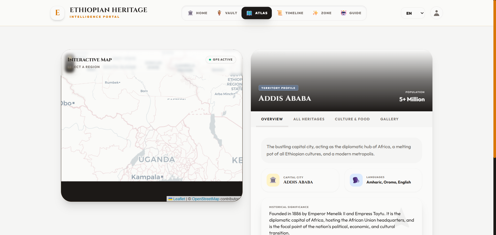

# Interactive Cultural Atlas

## Overview
The interactive Cultural Atlas allows users to explore the rich geographical and cultural diversity of Ethiopia through high-fidelity maps.

## Key Features
- **Regional Profiles:** Select specific regions to uncover local food, music, clothing, and landmarks.
- **Geospatial Data:** Rendered using detailed GeoJSON mapping.
- **Offline Fallbacks:** Core regional summaries remain interactive even without active map rendering.
